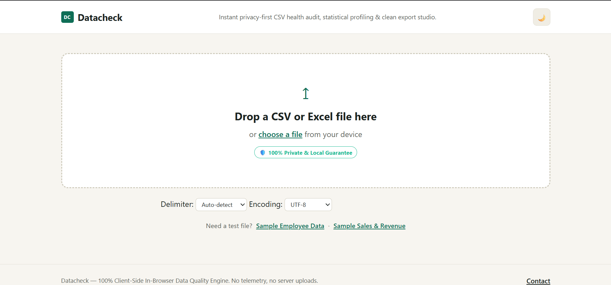
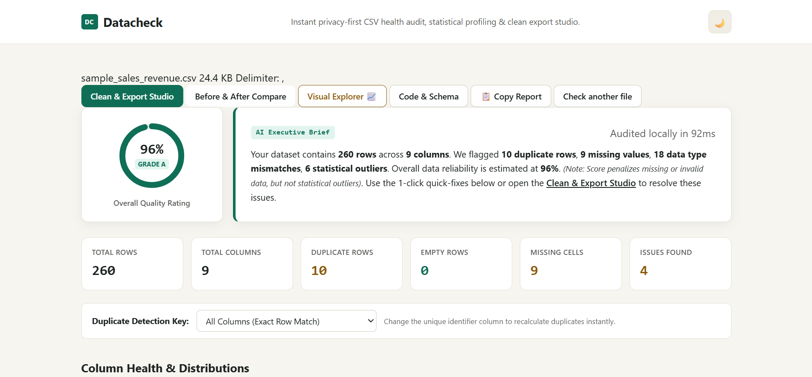
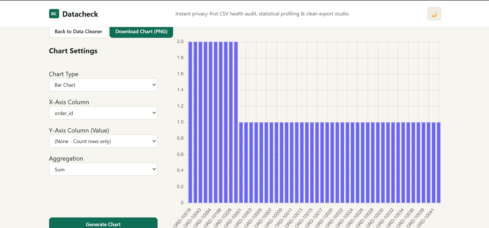

# Datacheck 📊

<div align="center">
  <p><strong>A 100% Client-Side, In-Browser Data Quality Engine & Visual Explorer</strong></p>
  <!-- [Placeholder for Landing Page Screenshot] -->
  
  <br/><br/>
  <!-- [Placeholder for Hero Screenshot] -->
  
</div>

<br/>

Datacheck is a lightning-fast, highly secure data cleaning and exploratory data analysis (EDA) tool. Built entirely with HTML, CSS, and vanilla JavaScript, it runs completely inside your web browser. 

**Zero server uploads. Zero telemetry. 100% Private.**

## ✨ Features

### 🛡️ Uncompromising Privacy
Your data never leaves your device. Because Datacheck leverages Web Workers and the HTML5 File API, it can process massive CSV and Excel files entirely locally. **It even works in airplane mode.**

### 🧹 Advanced Data Cleaning
- **Instant Anomaly Detection:** Automatically flags missing values, duplicates, format/type mismatches, and statistical outliers.
- **One-Click Fixes:** Drop all anomalies, impute missing values, and clean your dataset with a single click.
- **Smart Type Fallbacks:** Automatically detects if a column is a string, number, or boolean, and flags cells that don't match the expected schema.

### 📈 Visual Explorer (EDA)
- **Interactive Charting:** Generate Bar Charts, Scatter Plots, Line Charts, and Doughnut Charts instantly.
- **Dynamic Aggregation:** Group your data by Count, Sum, or Average.
- **Export Ready:** Download your "Before" and "After" charts as PNGs to include in your reports.

<!-- [Placeholder for Visualizer Screenshot] -->
<div align="center">
  
</div>

### 💻 Code & Schema Generation
Don't want to export a CSV? Datacheck automatically generates the exact Pandas/Python code or SQL schema needed to recreate your cleaned dataset programmatically. 

## 🚀 How to Run locally

Since Datacheck has no backend, installation is incredibly simple. You don't need Node.js, Python, or Docker.

1. Clone this repository:
   ```bash
   git clone https://github.com/yourusername/datacheck.git
   ```
2. Navigate into the folder:
   ```bash
   cd datacheck
   ```
3. Open `index.html` in any modern web browser (Chrome, Edge, Firefox, Safari).
   *No servers to start, no dependencies to install.*

## 🛠️ Technology Stack
- **Frontend:** Vanilla HTML5, CSS3, JavaScript (ES6)
- **Data Parsing:** [PapaParse](https://www.papaparse.com/) (for high-speed CSV parsing) & [SheetJS](https://sheetjs.com/) (for Excel support)
- **Visualization:** [Chart.js](https://www.chartjs.org/)
- **Performance:** JavaScript Web Workers (for non-blocking data analysis)

## 🤝 Contributing
Contributions, issues, and feature requests are welcome! Feel free to check the [issues page](https://github.com/yourusername/datacheck/issues).

## 📄 License
This project is open-source and available under the [MIT License](LICENSE).
